## Opción 2_Certificado_TLS/SSL

En este ejemplo vamos a instalar un certificado TSL/SLL en un hosting GoDaddy autorenovable de Let's Encrypt a través de acme.sh

Para empezar tenemos que habilitar SSH a través de la pagina del producto
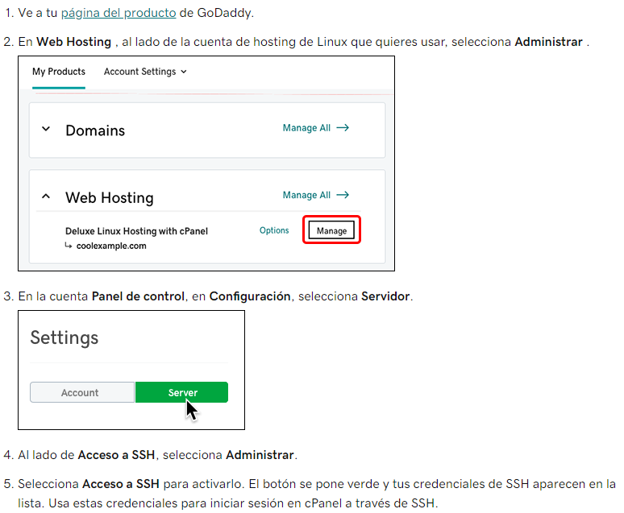

Una vez hecho tenemos que ingresar a nuestro hosting a través de la terminal con de algún programa como [Putty](https://putty.org/ "click en el enlace"), en mi caso uso [Solar-Putty](https://www.solarwinds.com/free-tools/solar-putty "Click en el enlace").

Ingresamos a la cuenta y en el directorio principal (home/usuario)escribimos lo siguiente:
curl https://get.acme.sh |sh
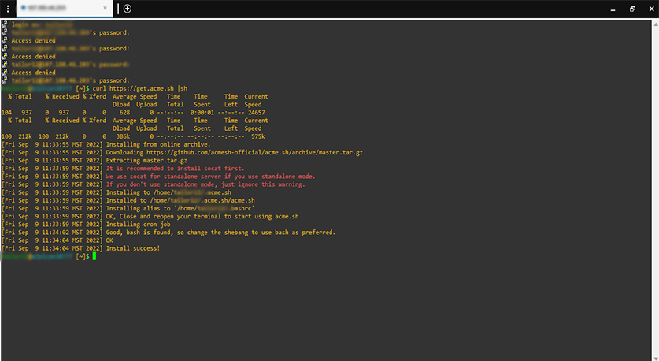

Ignoramos el mensaje en rojo:It is recommended to install socat first.

A continuación nos movemos de carpeta:
**$cd .acme.sh**
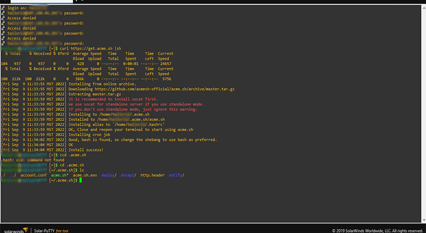

Una vez dentro de la carpeta escribimos:
**$ ./acme.sh -–issue -d yourdomain.com -d www.yourdomain.com -w /home/your-folder/public_html**

-d yourdomain.com [si tu dominio incluye www o no www]
-w /home/your-folder/public_html [Agrega la raíz de tu website, puede ser /var/www/html o /home/public_html o en dónde resida tu website]

En las caputuras de pantalla muestro lo errores que me presentó, tal vez en futuras instalaciones no arroje los errores en este caso sigo las [instrucciones que nos presentó](https://github.com/acmesh-official/acme.sh/wiki/ZeroSSL.com-CA), esto debido que en su momento instalé un certificado de **Zero SSL**  

$./acme.sh --set-default-ca --server letsencrypt

$./acme.sh --issue -d talentoespecializado.mx --dns dns_cf --server letsencrypt 

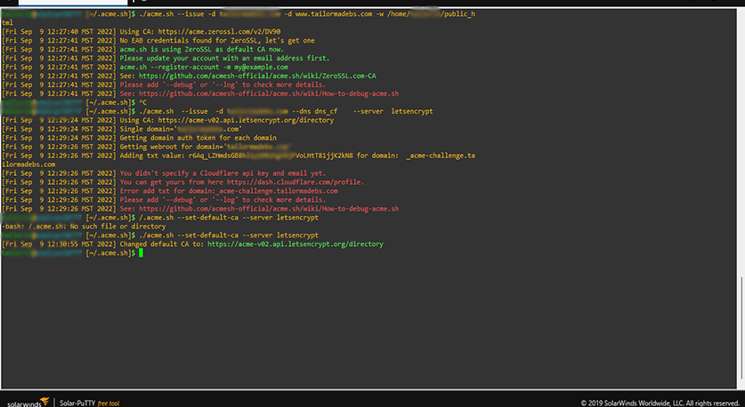

Una vez eliminado el error volvemos a ejecutar el comando anterior y nos arrojará el certificado, copiamos:

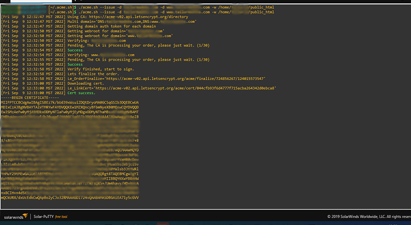

Luego vamos al CPanel e ingresamos la parte de certificados SSL/TSL y 
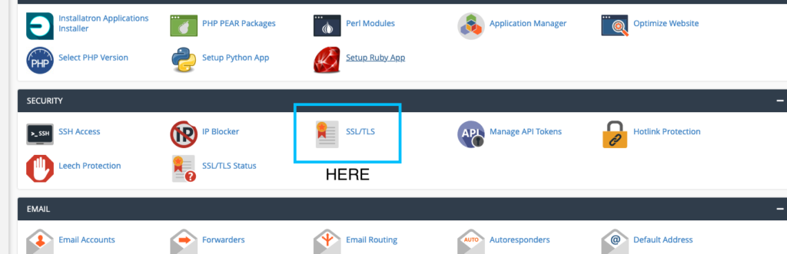

Click en **CERTIFICADOS CRT** Genere, vea, cargue o elimine certificados SSL.

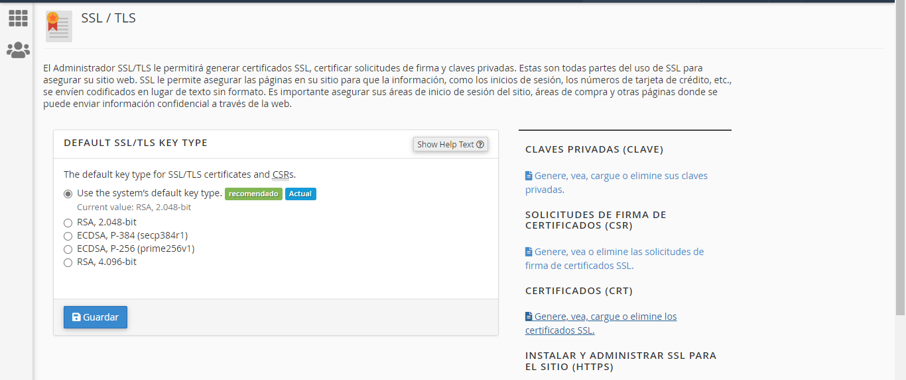

Ahora en la parte que dice cargar un nuevo certificado, pegamos el certificado que anteriormente habiamos copiado, click en guardar certificado.

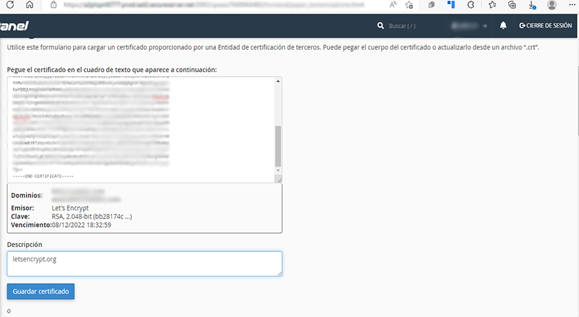

Ahora nos aparecerá el certificado, click en instalar

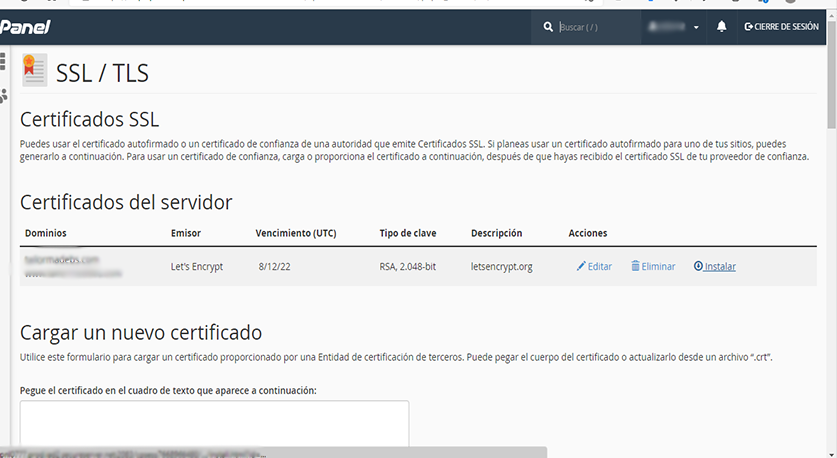 

Después vamos a pegar la llave (key), para eso tenemos que ir de nuevo a la terminal en la carpeta [~/.acme.sh]cd nombredetunomino.com> y dentro de ella presionamos [~/.acme.sh/nombredetudominio.com]$ls y vamos abrir con nano el archivo nombredetudomino.key  

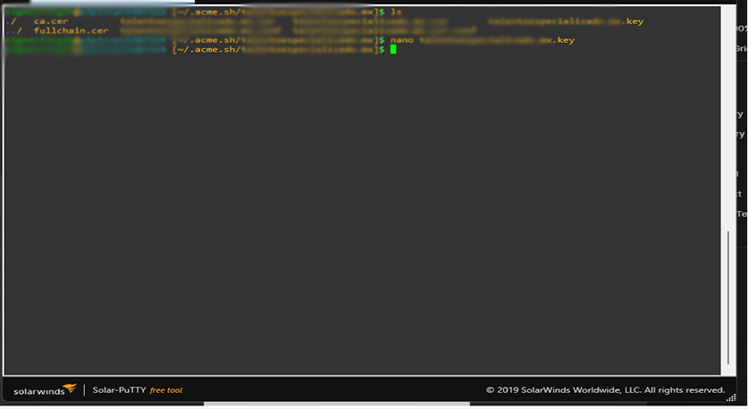

Ahora debemos copiar el key
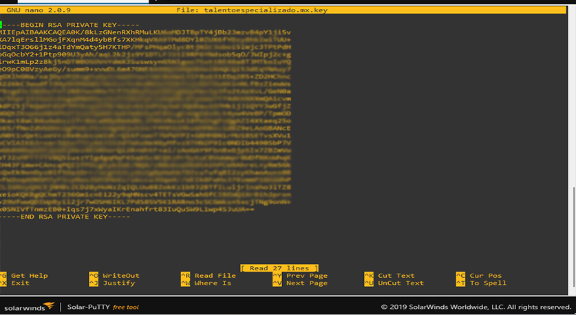

Y lo pegamos en donde dice clave privada, click en **Instalar certificado**
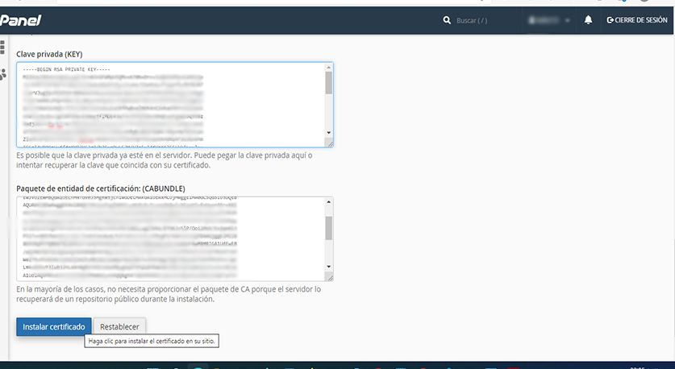

Y nos mostrará la siguiente pantalla, que indica que se instaló con exíto el certificado SSL/TLS

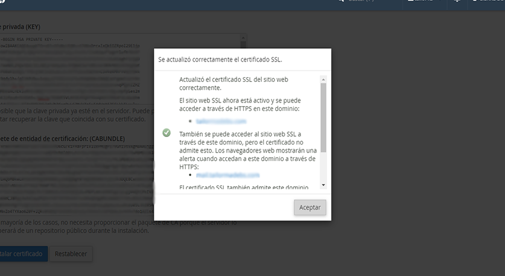

Pdemos revisar la web y nos mostrará la fecha de incio y finalización del certificado SSL/TLS

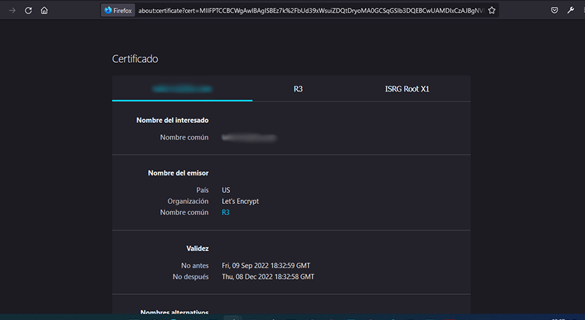